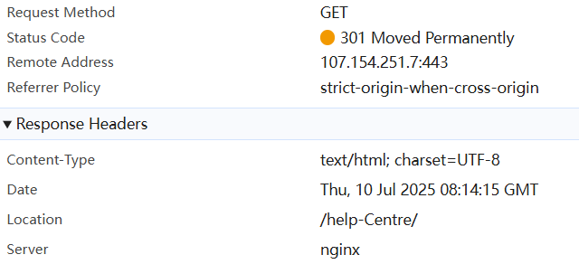
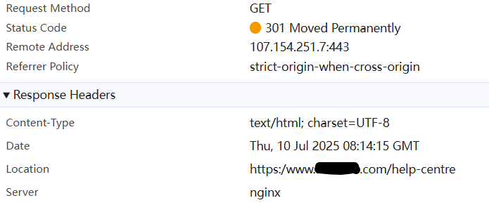

# Laravel/Nginx 重定向问题实战排查与解决全流程

## 前言

这个一个主包在实际项目开发中遇到的一个 bug

---

## 1. 问题现象

用户在页面 [https://www.abc.com/za/learn/trading-webinars/](https://www.abc.com/za/learn/trading-webinars/) 点击“Register now”按钮，本应跳转到：

```
https://www.abc.com/za/webinar/beyond-the-headlines-sector-insights/
```

但实际却跳转到了：

```
https://www.abc.com/www.abc.com/za/webinar/beyond-the-headlines-sector-insights/
```

Chrome 开发者工具的 Initiator 链路也清楚显示了这个“重复域名”的重定向路径。

---

## 2. 浏览器行为与 HTTP 重定向基础

### 2.1 Location 响应头的两种写法

- **相对路径**：`Location: /foo/bar/`  
  浏览器会自动补全为当前域名下的完整 URL。
- **绝对路径**：`Location: https://www.abc.com/foo/bar/`  
  浏览器会直接跳转到这个完整 URL。

### 2.2 错误示例

如果服务器返回：

```
Location: /www.abc.com/za/webinar/beyond-the-headlines-sector-insights/
```

浏览器会跳转到：

```
https://www.abc.com/www.abc.com/za/webinar/beyond-the-headlines-sector-insights/
```

**注意**：只有 `Location` 头是完整 URL（带 http/https）时，浏览器才不会再加一层域名。

---

## 3. 排查Nginx 层的可能影响

主包反复查看项目代码中对web请求的处理，多次对比本地、QA 环境及 PROD 在同一位置的效果，但是发现本地和 QA 功能都正常。无解，只能转战排查Nginx。

### 3.1 常见错误配置

```nginx
rewrite ^/(.*)$ /$host/$1 permanent;
```
这样会把 `$host`（如 `www.abc.com`）拼到路径里，导致请求变成 `/www.abc.com/xxx`。

### 3.2 本案例分析

本案例中，Nginx 并没有直接返回带域名的路径，但**如果 Nginx 反向代理或 rewrite 配置有误，可能会污染 PHP 的 `$_SERVER['REQUEST_URI']`**，让 Laravel 误以为路径中带有域名。

小结语：不过主包和运维沟通一起查看了服务器Nginx配置后，并没有发现相关问题，遂继续排查代码。

---

## 4. Laravel 重定向中间件的排查

### 4.1 关键代码片段

#### forceTrailingSlashes 方法

```php
private function forceTrailingSlashes(Request $request)
{
    $path = $request->getPathInfo();
    if (!empty($path) && !str_ends_with($path, '/')) {
        $parts = explode('?', $_SERVER['REQUEST_URI'], 2);
        $this->redirect_url = $parts[0] . '/' . (isset($parts[1]) ? '?' . $parts[1] : '');
        $this->response_code = 301;
        $this->trigger = 'trailing slashes';
    }
}
```

#### forceLowercase 方法

```php
private function forceLowercase(Request $request)
{
    $path = $request->path();
    if (preg_match('/[A-Z]/', $path)) {
        $newPath = Str::lower($path);
        if ($newPath !== $path) {
            $queryString = $request->getQueryString();
            if ($queryString) {
                $newUrl = url($newPath) . '?' . $queryString;
            } else {
                $newUrl = url($newPath);
            }
            $this->redirect_url = $newUrl;
            $this->response_code = 301;
        }
    }
}
```

#### setMyRedirectHeader 方法

```php
private function setMyRedirectHeader(Request $request, $client_ip, $redirects_num)
    {
        if ($this->redirect_url) {
            $this->redirect_url = str_replace(['/eu/', '//'], '/', $this->redirect_url);
            if ($this->redirect_url !== $request->getRequestUri()) {
                header("x-redirect-loc: mw:redirects:{$redirects_num}");
                header('x-trigger: ' . $this->trigger);
                header('Location: ' . $this->redirect_url, true, $this->response_code);
                exit;
            }
        }
    }
```

### 4.2 发现的核心问题

- **forceTrailingSlashes** 直接用 `$_SERVER['REQUEST_URI']`，如果这个变量被污染（如 `/www.abc.com/xxx`），拼接出来的重定向路径就会带上域名。
- **forceLowercase** 用 `url($newPath)` 生成完整 URL，但如果 `$newPath` 本身带了 `/www.abc.com/xxx`，就会拼成 `https://www.abc.com/www.abc.com/xxx`。
- **setMyRedirectHeader** 对完整 URL 做了 `str_replace`，可能破坏协议部分，导致 `https:/www.abc.com/xxx` 这种错误。

---

## 5. 实际案例

在与运维排查 Nginx 无果后，主包继续转战代码，由于之前对项目的重定向逻辑不熟悉，排查得十分痛苦。但是功夫不负有心人，在强大的 AI 工具的帮助下，主包排查出了表层原因：

当用户访问 `https://www.abc.com/help-Centre/`时，会进入项目重定向逻辑中的 `forceLowercase`。在这里，主包注意到 `url($newPath)`，这个方法会返回完整的携带有域名的 URL。

主包凭借超人的直觉，初步怀疑是这个方法的原因，随排查请求有问题的路径。果不其然，就是路径里包含大写的问题。而在本地和测试环境，同样的测试路径都被配置成完全小写的 string，在生成环境却包含了大写字母。主包大胆修改地 lowercase 正式环境配置的路径，跳转正常了！

线上问题解决了，主包也把解决方法反馈给了 bug reporter。尽管如此，主包觉得这只是一个表面上的解决方法，实际问题是：用户输入的网站路径里只要有大写字母，就会出现这个域名重复的问题。

主包决定继续排查这个问题。

------

既然确定了是代码里重定向逻辑的问题，主包决定逐步模拟web请求输入经过重定向中间件的过程。

我们访问 `https://www.abc.com/help-Centre`，经过 forceTrailingSlashes 的处理，返回如下图，没毛病




进入下一次请求：https://www.abc.com/help-Centre/

经过方法 `forceLowercase`，返回如下，这次就有大问题了！正如我们上面提到的，Location 可以是携带 http 协议的完整 URL，这样浏览器不会处理，会直接跳转到 Location 所指 URL。如果 Location 是不携带 http 协议的普通路径，形如 `/a/b/`，那么浏览器会自动补全路径。

但是很明显，现在这个Location不属于上面提到的任何一种情况



接下来请求转到 `https:/www.abc.com/help-centre`（只有一个斜杠），浏览器会把 `www.abc.com` 当作路径，服务器收到的 `REQUEST_URI` 是 `/www.abc.com/help-centre`，最终重定向到 `/www.abc.com/help-centre/`，浏览器拼成 `https://www.abc.com/www.abc.com/help-centre/`

其实，罪魁祸首就在setMyRedirectHeader里：

```
$this->redirect_url = str_replace(['/eu/', '//'], '/', $this->redirect_url);
```

上面这一步，把 `forceLowercase` 里 `url()` 返回的完整路径重构了，导致了返回 `https:/www.abc.com/help-centre`，以及之后的一系列问题。

主包刚开始怀疑是 `url()` 的问题，但是其实它没有问题，是上面这行代码把 `url()` 返回的路径重构了，才出的问题。

由于这两块代码是两个不同的研发同事写的，`str_replace` 这行代码是最新的修改，而且看起来是为了某些奇怪的原因而写的代码，可能有坑，主包不敢轻易改动。而且由于网站大部分都是站内跳转，没必要使用完整 `url`，于是主包把 `forceLowercase` 里 `url()` 的使用给替换掉了：

```\
$newUrl = '/' . $newPath . ($queryString ? '?' . $queryString : '');
```

当然，还可以修改 `setMyRedirectHeader` 只对相对路径做替换

```php
if (!preg_match('#^https?://#', $this->redirect_url)) {
    $this->redirect_url = str_replace(['/eu/', '//'], '/', $this->redirect_url);
}
```

---

## 6. 总结与最佳实践

- **重定向时优先用相对路径**，让浏览器自动补全域名和协议，避免多环境下 host 被污染。
- **只在跨域跳转时用完整 URL**。
- **不要对完整 URL 做全局字符串替换**，只对路径做处理。
- **多环境下多加日志，及时发现和定位问题。**

---

## 7. 参考资料

- [MDN: HTTP 重定向](https://developer.mozilla.org/en-US/docs/Web/HTTP/Redirections)
- [Laravel 文档：url() 辅助函数](https://laravel.com/docs/10.x/helpers#method-url)

---

